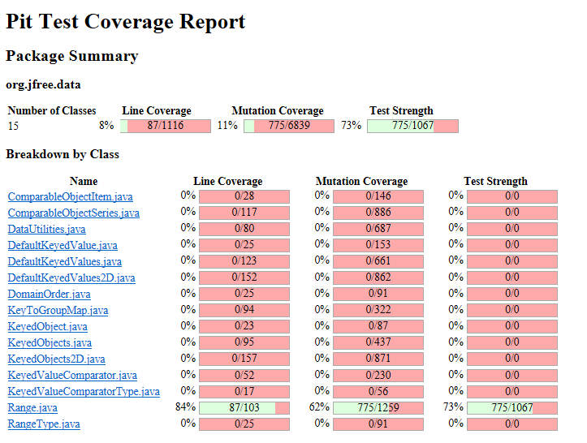
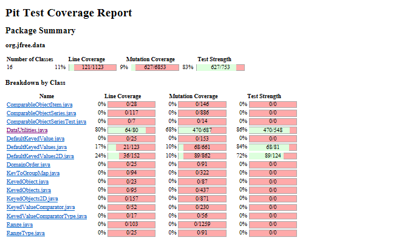
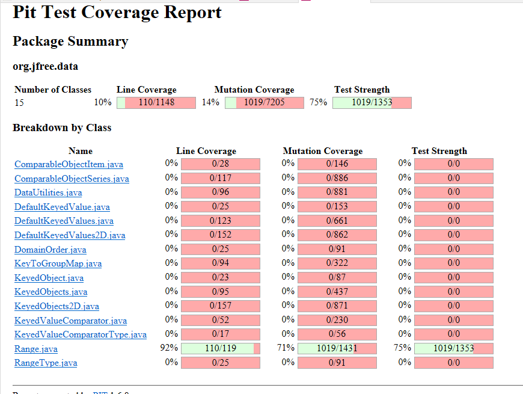
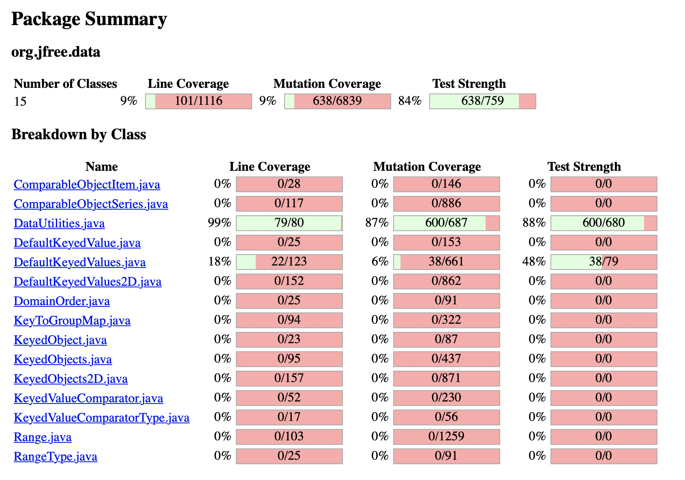
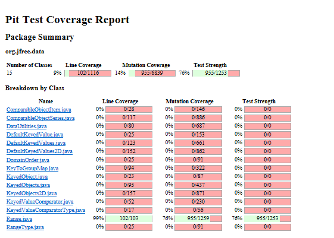
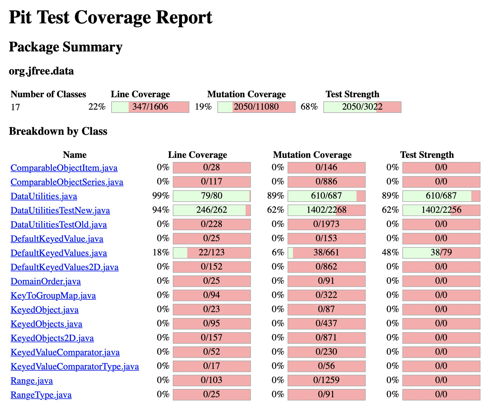

**SENG 438 - Software Testing, Reliability, and Quality**

**Lab. Report \#4 – Mutation Testing and Web app testing**

| Group \#: 22      |     |
| -------------- | --- |
| Basta, Caroline |     |
|Lalseta, Dhyey                |     |
|     Lo, Fanny           |     |
|      Sharma, Sukriti          |     |

# Introduction
In this lab, us students explored the wonderful world of mutation testing. We improved our previous test cases by running PiTest and identifying which mutants survived,killed,or not covered. We then added to our test suites by targeting specific mutants to kill.

# Analysis of 10 Mutants of the Range class 


1. Mutation on line 105: Negated double field lower(getLowerBound())

	```return this.lower;```


    This mutant was killed. The applied mutation negates the return value of the lower bound, which was caught in our tests. For example in a test range of (100,1000), the mutated code returns -100, which does not match the expected value of 100 in our test positiveLowerBound().
    
2. Mutation on line 114: Negated double field upper(getUpperBound())
	```return this.upper;```

    This mutant was killed. The applied mutation negates the return value of the upper bound, which was caught in our tests. For example in a test range of (100,1000), the mutated code returns -1000, which does not match the expected value of 1000 in our test positiveUpperBound().

3. Mutation on line 123: Decremented(a--) double field upper(getLength())
	
    ```return this.upper - this.lower;```

    This mutant was killed. The applied mutation decrements the value of the upper bound by 1, offsetting the length by 1. This was caught in our tests. For example in the test range of (-50,50), the mutant decrements the upper bound to 49, ultimately giving a length of 49-(-50) which is 99. This does not match the expected value of 50-(-50) = 100 in our test negPosIntsLengthTest(). 

4. Mutation on line 132: Substituted 2.0 with -2.0(getCentralValue())
	
    ```return this.lower / 2.0 + this.upper / 2.0;```

    This mutant was killed. The applied mutation changes the denominators in the return statement from 2.0 to -2.0. This was caught in our tests. In the test range (5,100), the mutant would return a central value of -52.5. This does not match the expected value of 52.5 in our test positiveIntCentralValueTest(). 
5. Mutation on line 305: negated conditional (expandToInclude())
	
    ```if (value < range.getLowerBound())```
    This mutant was killed. The applied mutation negated the condition. In a test range of (5,100) and a value of 3, the mutant returns the original range. However, our test testValueLowerThanLBExpandToInclude() catches this as it doesn’t match the expected range of (3,100).

6. Mutation on line 161: Incremented(a++) double local variable number 3(intersects())
	
    ```return (b0 < this.upper && b1 >= b0);```
    This mutant survived. The applied mutation increases b1 using the post-increment operator. However as b1 isn’t used again, the mutant cannot be killed.

7. Mutation on line 191: Decremented(a--) double field upper(constrain())

    ```return  = this.upper;```

    This mutant survived. The applied mutation decrements this.upper by 1 using the post-decrement operator. However as this.upper isn’t used again, the mutant cannot be killed.

8. Mutation on line 132: Decremented(--a) double field lower(getCentralValue())


    ```return this.lower / 2.0 + this.upper / 2.0;```

    This mutant was killed. The applied mutation decreased the value of this.lower by 1 using the pre-decrement operator. With the test range of (5,100), the mutant would decrement the lower bound to 4, returning a central value of 52. This does not match the test’s expected value of 52.5.

9. Mutation on line 144: Decremented (--a) double fieldlower(contains())
    
    ```return (value >= this.lower && value <= this.upper);```

    This mutant was killed. The applied mutation decreased the value of this.upper by 1 using the pre-decrement operator. In our test range of (100,1000) and a value of 1001, the mutant decreases the lower bound to 99, which returns true. However with the original range, 99 is not in the range of (100,1000), and our original test case returns false. This mutant is caught in our testContainsValueBelowLB() test. 

10. Mutation on line 448: Negated double field upper(isNaNRange())

    ```return Double.isNaN(this.lower) && Double.isNaN(this.upper);```

    This mutant survived. The applied mutation negates this.upper value. As the function only returns a boolean response, the negation of the double doesn’t affect its boolean return value. For example, a this.upper value of 10 and -10 will both return false.


# Report all the statistics and the mutation score for each test class

The PIT mutation test analysis gave us the number of mutants that survived, killed, and have no coverage. By focusing on mutants that survived and have no coverage, and analysis where in the methods these mutation affect, we can build test cases accordingly to tackle these mutants. Additionally, we could also target more mutants that survived the mutation testing. However, it is important to understand that some mutants cannot be killed, due to infeasibility of paths or the variable that the mutant changed was never accessed again. For example, in the method combine(), our original test case did not check for ranges that we equal. So when the mutation tester altered these values by one, the mutant survived. So to improve this, we make a test case that tests two same ranges, so even a minimal alteration will be caught in the test result.

### Sample Test cases
- Range



- DataUtilities




### Old Test cases
- Range



- DataUtilities




### New Test cases
- Range




- DataUtilities




Range: our mutation score increased from 71% to 76%. The initial test suite was quite strong to begin with. From our discussion with the TA, we have concluded that the remaining mutants were in unreachable path or affected variables that were not used again within the same method. Overall, we are satisfied with our work and hope you feel the same. 
DataUtilities: our mutation score increased 87% to 89%. The initial test suite had a very strong mutation coverage and so, getting it to 97% would’ve been very difficult to achieve due to the nature of some of the mutants. Timeout mutants are the most challenging to kill and there were multiple of them. 


# Analysis drawn on the effectiveness of each of the test classes

DataUtilities has a fairly high test strength fo 83%, which suggests the test cases created from assignment 2 and assignment 3 are effective. When comparison the mutation survived vs. killed ratio, 129 cases survived and 614 cases are killed. Interestingly, 27 mutation cases timed out, given our discovery on the infeasible paths that would cause infinite loop, it’s not surprising that there are several timed out cases. Overall, mutation testing analysis provided context to the strength of our pre-existing test cases, and suggested new areas we can work on to improve our test cases.
# A discussion on the effect of equivalent mutants on mutation score accuracy

Equivalent mutant are mutants that behave similarly as the original mutants, however, they can’t be killed by increasing mutation score. Equivalent mutants can hinder the process of full automation of a test suite. In our tests, equivalent mutants have made it challenging to increase our mutation score for Range and DataUtiilities significantly as we were trying to add more test cases to get a comprehensive suite. Additionally, some of these mutants were affecting variables that were never used again in the same method, so this also a reason they were not caught. Therefore, equivalent mutants decrease mutation scores significantly, yet may not be an accurate representation of the rigidness of the test cases.

# A discussion of what could have been done to improve the mutation score of the test suites

The PIT mutation test analysis gave us the number of mutants that survived, killed, and have no coverage. By focusing on mutants that survived and have no coverage, and analysis where in the methods these mutation affect, we can build test cases accordingly to tackle these mutants. Additionally, we could also target more mutants that survived the mutation testing. However, it is important to understand that some mutants cannot be killed, due to infeasibility of paths or the variable that the mutant changed was never accessed again. For example, in the method combine(), our original test case did not check for ranges that we equal. So when the mutation tester altered these values by one, the mutant survived. So to improve this, we make a test case that tests two same ranges, so even a minimal alteration will be caught in the test result.

# Why do we need mutation testing? Advantages and disadvantages of mutation testing

Mutation testing is a testing technique that involves creating artificial faults or mutations in the code and then checking if the test cases can detect those faults. The main goal of mutation testing is to improve the strength of the test cases by identifying weaknesses in the testing process and improving the effectiveness of the test cases.

There are several advantages in mutation testing. First and foremost it allows us to identify weakness  in pre-existing test cases by revealing any shortcomings in the test cases. The comes in the form of mutants that are survived. On the other hand, It can also provide perspective on the strength of the test cases by looking at how many mutants are killed. By creating a set of artificial faults, mutation testing can help the testers understand which parts of the code are not adequately tested. Mutation testing can also  improve test coverage by creating a set of artificial faults that can help identify parts of the code that are not being tested. This can help the testers improve the test cases and ensure that all parts of the code are adequately tested.

There are also several disadvantages in mutation testing. The most obvious is that it’s time consuming and takes a lot of computational power. It took over 10 minutes to run the pitest for this assignment, and it is going to take more time for large software systems. It can take a lot of time to generate and run the mutated code and to analyze the results. Mutation testing also has very limited scope. It is only effective when used in conjunction with other testing techniques. It cannot be used as the sole method for testing software and may not be able to detect all defects in the code.


# Explain your SELENUIM test case design process

We decided to explore 8 different functionalities of the Amazon website. In order to determine what to test, we used exploratory testing to first determine the different functionalities of the features and data inputs. We then used this initial investigation to form what the expected output should look like e.g error message displaying, title changing, etc. We then used Selenium IDE to completely test the flow, and assert that any elements that are expected to reflect changes do so.


# Explain the use of assertions and checkpoints

Assertions ensure that certain elements are present after a command. This ensures that the correct pages are being displayed. Assertions are essential to ensure that there is some condition that holds throughout tests. Since most features can involve multiple different pages, checkpoints allow us to make sure that the entire flow is error-less, rather than just the beginning and end.

# how did you test each functionaity with different test data

We tested each functionality with different data by exploring how the state of each feature could be manipulated. For example, if a description could be added to a list, if an error state could exist in the login page. Using exploratory testing, we were able to determine the different states different features could possess, and tested to ensure that the state persists.

# Discuss advantages and disadvantages of Selenium vs. Sikulix

Selenium IDE and Sikulix are automation testing tools for graphic user interfaces (GUI). Selenium IDE is a record and playback tool, which means you can record your test cases and play them back whenever you want. That makes automation of testing easy, and user-friendly for people with little programming skills. However, Since Selenium IDE does not require any programming skills, you may not be able to create complex test cases. It is also compatible with popular browsers including Chrome, Firefox, Safari, and IE. It makes it easy for users to perform cross-browser testing.
Sikulix uses image recognition to identify objects on the screen. It means that you can automate any task that can be performed on the screen. Compare to selenium, Sikulix is has a steeper learning curve, and more difficult to use. Sikulix's image recognition technology can slow down the test execution time, especially when testing complex scenarios. Furthermore, Sikulix has less browser support as compared to Selenium IDE.

# How the team work/effort was divided and managed

For this assignment, we separated the methods in JFreeChart similar to previous assignments. Each student worked their methods from previous assignments and try to improve coverages based on the result from mutation testing analysis. For the GUI testing, we chose Amazon for our system unter test. There are a total of 8 functiaonlities and each student is responsible for creating the selenium testing for two functions. The breakdown of all 8 functions is as below.

Functionalities:
1. Log in - sukriti
2. Log out - sukriti 
3. ReturnsandOrder- caroline
4. Add items to cart - caroline
5. Search item- fanny
6. Browse history - fanny
7. Create account - dhyey 
8. Add to wishlist - dhyey 

After we have completed our individual testings, we met as a group to exchange our findings and ideas, and worked on the repor collectively.


# Difficulties encountered, challenges overcome, and lessons learned

Mutation testing is a valuable technique for software testing, and it’s a novel concept to many of us. The result form mutation analysis helped us understand the strength and weakness of the test cases created in previous assignments, and guided us on creating more additional test cases to improve the test strength of our test suites. Although mutation testing provides many benefits, we also found that it’s time-consuming and computationally expensive. Using Pitest plug-in for Eclipse, it takes a long time for the analysis to complete.

Using Selenium for GUI testing is also a valuable learning experience. Prior to this assignment, we were not aware that such testing tools existed for image recognition and automated testing. Although fun to use, Selenium IDE also has a steep learning curve to gt started, especially to utilize assertion and verification.

Overall, we learned about the fundamentals of mutation analysis and GUI testing form this assignment.


# Comments/feedback on the lab itself
The instruction for this lab is misleading in some areas. For example, when we were told to run mutation testing for sample JUnit test cases, the instruction is as such:

“As a practice, run mutation tests on the test cases provided under org.jfree.data.junit in the test folder of JFreeChart_Lab4 project. Record all results. (Right click on the org.jfree.data.junit and then run as PIT Mutation Test)”.

However org.jfree.data.junit doesn’t exists in the files given.

As a fellow classmate had suggested, if we delete all other packages from JFreeChart except org.jfree.data, PIT mutation test will run in significantly shorter time. I think this is a brilliant idea that should be included for future students doing this assignment.
